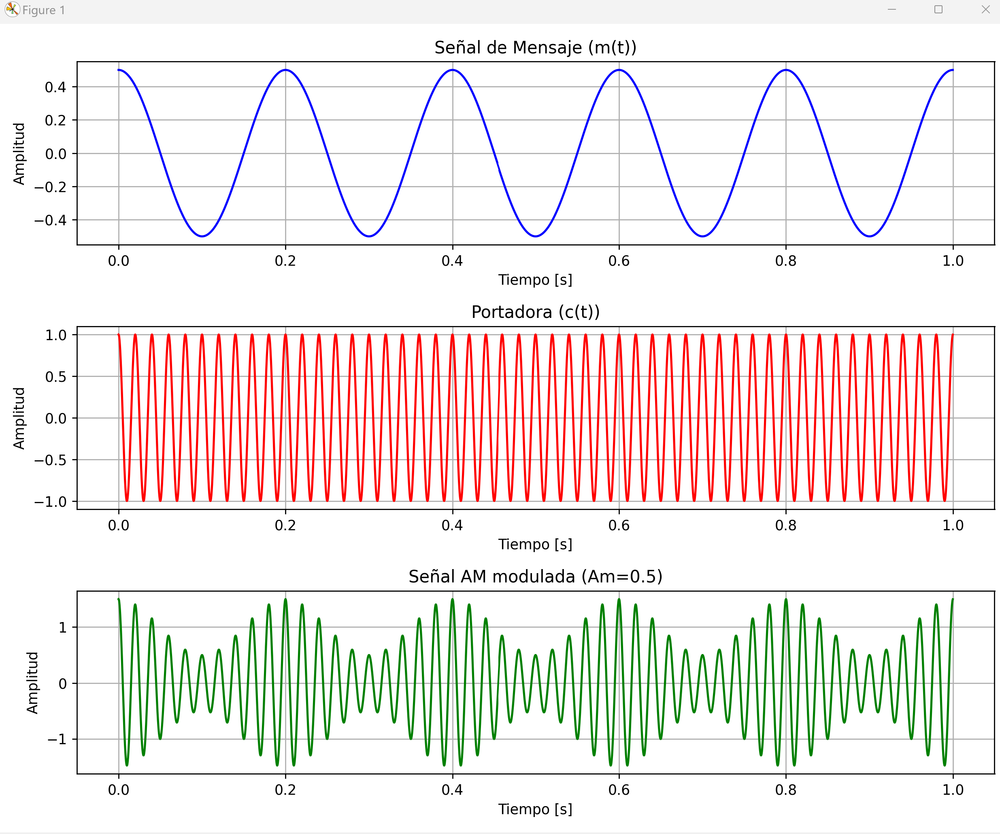
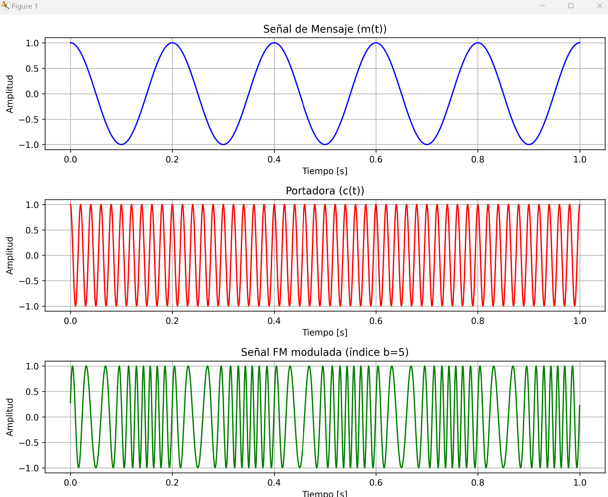
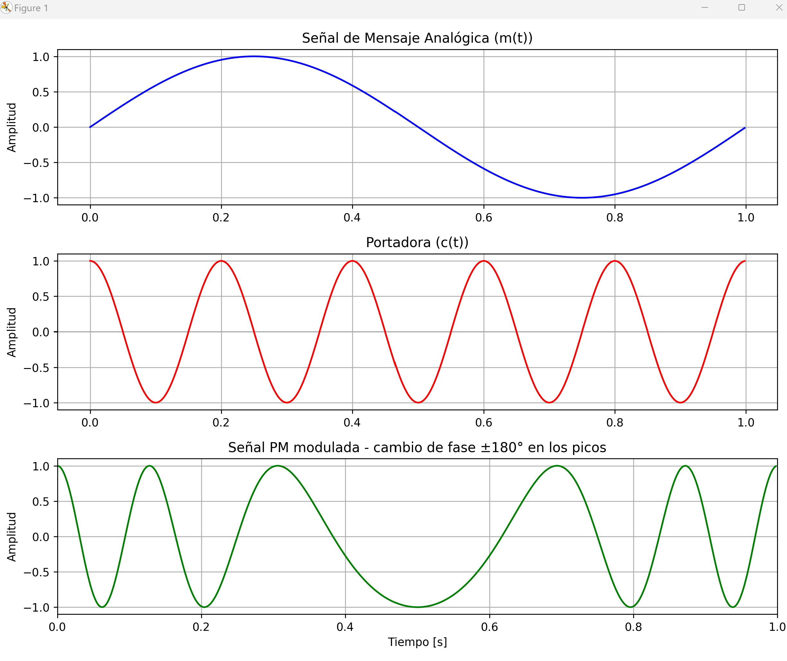
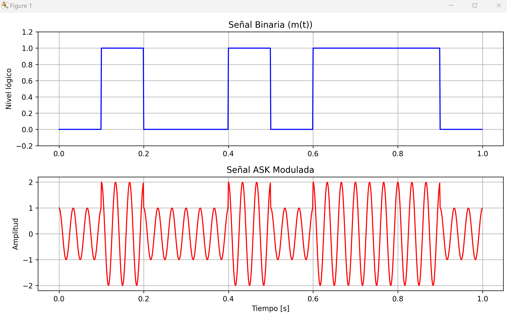
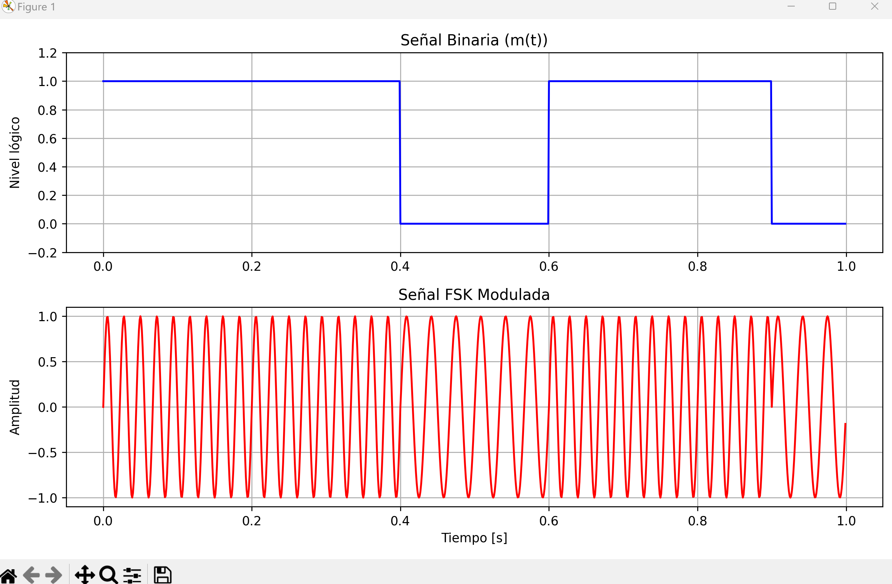
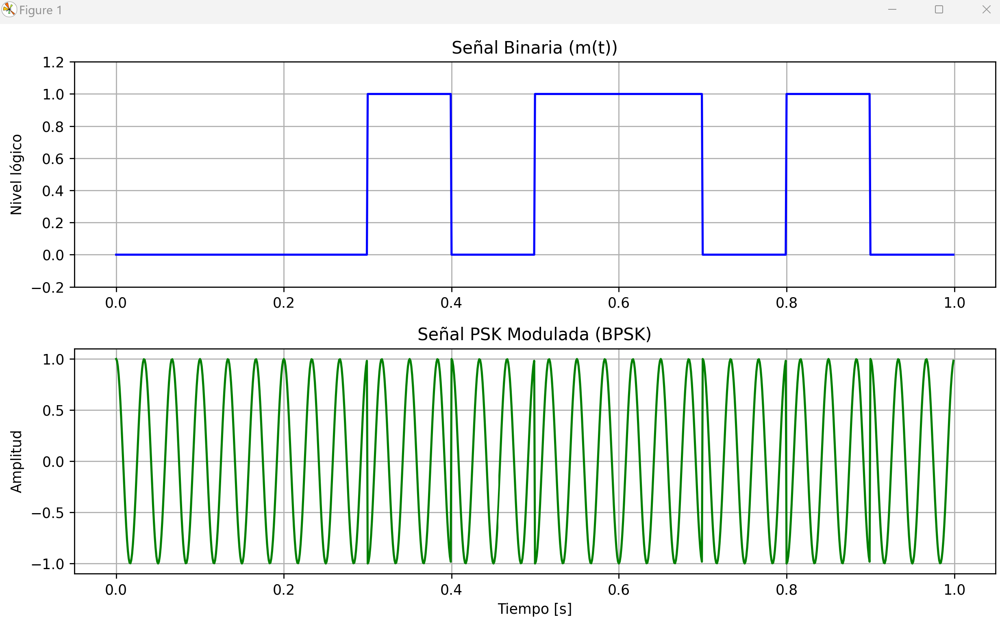

# Fundamentos de Telecomunicaciones 
## Ejemplos de Modulaciones 

Este repositorio contiene **scripts en Python** que muestran ejemplos de diferentes técnicas de **modulación**, desarrollados como material de apoyo para la **clase de Modulaciones** de la materia **Fundamentos de Telecomunicaciones**.

Los scripts permiten **visualizar señales moduladas** de manera didáctica, tanto para **modulaciones analógicas** como digitales.

---

### Contenido

- `AM_modulation.py` : Modulación de amplitud (AM), incluyendo casos submodulado, bien modulado y sobreamodulado.  
- `FM_modulation.py` : Modulación de frecuencia (FM), mostrando cómo la frecuencia de la portadora sigue la señal de mensaje.  
- `PM_modulation.py` : Modulación de fase (PM) con ejemplos didácticos de cambio de fase según el mensaje analógico.  
- `FSK_modulation.py` : Modulación por desplazamiento de frecuencia (digital).  
- `ASK_modulation.py` : Modulación por desplazamiento de amplitud (digital).  
- `PSK_modulation.py` : Modulación por desplazamiento de fase (BPSK, digital).

---

### Requisitos

- Python 3.10 o superior
- Librerías Python listadas en `requirements.txt`

Instalación de dependencias:

```bash
# Crear un entorno virtual (opcional pero recomendado)
python -m venv .venv
# Activar entorno virtual
# Windows
.venv\Scripts\activate
# Linux / MacOS
source .venv/bin/activate

# Instalar todas las dependencias
pip install -r requirements.txt
```

### Uso

Ejecutar cada script por separado:

```bash
python mod_am.py
python mod_fm.py
python mod_pm.py
python mod_ask.py
python mod_fsk.py
python mod_psk.py
```

Cada script abrirá una ventana de gráficos mostrando la señal de mensaje, la portadora y la señal modulada.

### Ejemplos de ejecucion

- Modulacion AM

- Modulacion FM

- Modulacion PM

- Modulacion ASK

- Modulacion FSK

- Modulacion BSK


---

**Autor:** Damian del Campo<br>
**Materia:** Fundamentos de Telecomunicaciones<br>
**Clase:** Modulaciones
